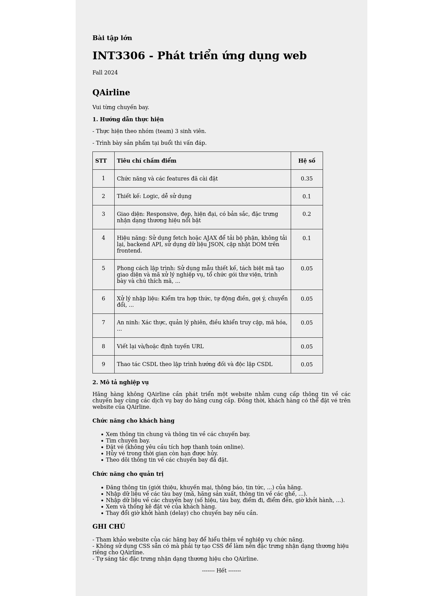

# QAirline - Vui từng chuyến bay

Ứng dụng web quản lý đặt vé máy bay cho công ty QAirline. Chi tiết yêu cầu của ứng dụng web này như sau:



---
## Chức năng
* Đối với khách hàng:
  - Xem thông tin các chuyến bay mình đã đặt
  - Tìm kiếm chuyến bay dựa trên điểm đến, điểm đi và ngày bay
  - Đặt vé máy bay
  - Huỷ vé (trong thời gian được huỷ)
  - Xem các bài đăng, khuyến mãi,... được đăng trên trang web
* Đối với admin:
  - Đăng thông báo, khuyến mãi,... lên web
  - Quản lý (sửa, thêm thông tin,...) các chuyến bay, hãng bay đối tác,...
  - Sửa, thêm thông tin các tàu bay
  - Quản lý (xem, sửa thông tin, xoá/huỷ) đặt chỗ 

---
## Chạy project
* Yêu cầu với môi trường trước khi chạy
  - Node.js và npm 
  - MySQL cho database
  - Golang
  - Docker và docker-compose (backend)
  - Air (live reload cho golang backend)
* Các bước chạy
  1. Clone project này về, sau đó:
     ```bash
     cd INT3306054---QAirline
     ```
  2. Chạy backend:
     ```bash
     cd backend
     docker-compose up -d
     ```
     Backend sẽ được chạy ở port 5050
  3. Chạy frontend
     ```bash
     cd frontend
     npm install
     npm start
     ```
    Frontend được chạy ở port 3000.

---
# Demo
Video demo webapp tại [đây](https://drive.google.com/drive/u/0/folders/1BMiSJuRpR-4vlAiy4CreEMI9_vQ_lKEi).

---
# Dự định 
Do thời gian làm ứng dụng web có hạn (trong khoảng 2 tháng), và team làm sản phẩm đều bận nhiều project/deadlines khác nhau trên trường, còn có một số điểm cần cải thiện/có thể nâng cấp hơn, hoặc thử để nâng chất lượng sản phẩm và kỹ năng của team dev.
- Deploy backend (docker-compose gồm api và mysql) lên cloud, chẳng hạn như AWS hay Azure
- Thêm redis để cache
